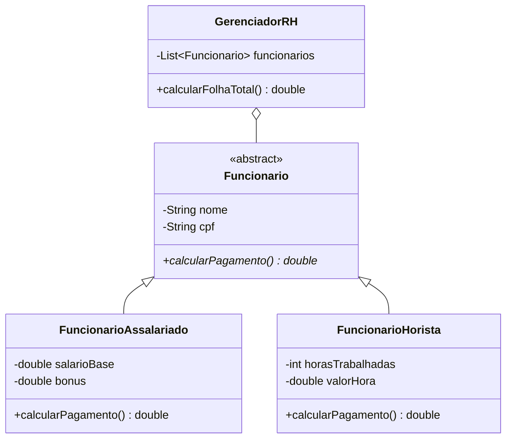

# FolhaRepo

[](https://github.com/mqrcio99/FolhaRepo/actions/workflows/ci.yml)

Aplicação de terminal em Java para cadastro de funcionários e cálculo do custo total da folha. O módulo principal é `GestaoFolhaPGT`, com fontes organizadas no pacote `gestaofolhapgt`.

## Funcionalidades implementadas

- Cadastro de funcionários assalariados, com salário-base e bônus.
- Cadastro de funcionários horistas, com valor por hora e horas trabalhadas.
- Validação e normalização de CPF, com rejeição de CPFs duplicados.
- Listagem de funcionários e cálculo do custo total da folha.
- Rejeição de valores negativos e repetição de perguntas quando a entrada numérica é inválida.

Os valores monetários ainda usam `double`. O sistema não persiste cadastros entre execuções.

## Roadmap

Os itens abaixo são planejados e não estão implementados:

- Cálculo de INSS e Imposto de Renda.
- Geração de contracheques.
- Relatórios além da listagem atual.
- Persistência de dados.

## Requisitos

- JDK 11 ou superior.
- Maven para compilar e executar os testes pela linha de comando.
- NetBeans é opcional; o projeto Ant permanece em `GestaoFolhaPGT`.

## Compilar e testar

Na raiz do repositório, execute:

```bash
mvn -B verify
```

O comando compila para Java 11, executa os testes JUnit 5 e empacota o JAR. A última validação local terminou com:

```text
[INFO] Tests run: 13, Failures: 0, Errors: 0, Skipped: 0
[INFO] BUILD SUCCESS
```

## Executar

Depois de `mvn -B verify`, execute:

```bash
java -jar target/gestao-folha-pgt-1.0-SNAPSHOT.jar
```

### NetBeans

Abra a pasta `GestaoFolhaPGT` como projeto existente no NetBeans e execute o projeto. A classe principal configurada é `gestaofolhapgt.GestaoFolhaPGT`; o projeto continua usando o build Ant do NetBeans.

## Exemplo de sessão

A sessão abaixo foi executada com dois funcionários e CPFs fictícios com dígitos verificadores válidos. Os menus são omitidos na saída resumida.

```bash
printf '1\nAna Assalariada\n00000000191\n3000,00\n500,00\n2\nBruno Horista\n00000000272\n20,00\n100\n3\n4\n0\n' \
  | java -jar target/gestao-folha-pgt-1.0-SNAPSHOT.jar
```

Saída relevante capturada nessa execução:

```text
Funcionário cadastrado com sucesso.
Funcionário cadastrado com sucesso.
====== FOLHA DE PAGAMENTO ======
1. Assalariado: Ana Assalariada | CPF: 00000000191 | Salário Base: R$ 3000,00 | Bônus: R$ 500,00 | Total: R$ 3500,00
2. Horista: Bruno Horista | CPF: 00000000272 | Horas: 100 | Valor/hora: R$ 20,00 | Total: R$ 2000,00
CUSTO TOTAL DA FOLHA: R$ 5500,00
Total da Folha: R$ 5500,00
Encerrando...
```

## Organização

```text
.
├── .github/workflows/ci.yml
├── GestaoFolhaPGT/
│   ├── nbproject/
│   ├── src/gestaofolhapgt/
│   └── test/gestaofolhapgt/
├── pom.xml
├── README.md
└── LICENSE
```

## Modelo e decisões

`Funcionario` é abstrata e define os dados de identidade e o contrato `calcularPagamento()`. `FuncionarioAssalariado` calcula salário-base mais bônus; `FuncionarioHorista` calcula horas multiplicadas pelo valor por hora. `GerenciadorRH` mantém os funcionários e agrega pagamentos sem escrever no console; `GestaoFolhaPGT` cuida do menu e das mensagens.

A classe abstrata concentra identidade e comportamento comum, enquanto o polimorfismo permite somar pagamentos sem ramificar pelo tipo concreto. Separar o menu do gerenciador permite testar as regras do domínio sem depender da interface de terminal.



## Licença

Licença MIT. Consulte [LICENSE](LICENSE).
